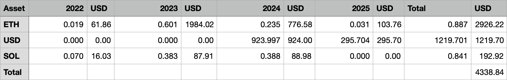

# Kraken API client for Java

[](https://central.sonatype.com/artifact/dev.andstuff.kraken/kraken-api)

Query [Kraken's REST API][1] in Java.

## Maven

```xml
<dependency>
    <groupId>dev.andstuff.kraken</groupId>
    <artifactId>kraken-api</artifactId>
    <version>3.0.0</version>
</dependency>
```

## Examples

The `examples` folder contains real-world examples that make use of this library. For most examples, you'll need to provide your API keys: rename `api-keys.properties.example`, located in `examples/src/main/resources`, to `api-keys.properties` and fill in your API keys. The file is also picked up from the root of the checkout, or from any parent directory of the one the example is run from. The examples can be run directly from your IDE, or using the command line:

```shell
# clone and build project
git clone https://github.com/nyg/kraken-api-java.git
cd kraken-api-java
mvn clean install

# run the staking rewards summary example
mvn -pl examples exec:java -Dexec.mainClass=dev.andstuff.kraken.example.StakingRewardsSummaryExample
```

### Staking Rewards Summary

This example will generate the `rewards-summary.csv` file, showing how much crypto rewards have been earned since the creation of your account. A picture is worth a thousand words:



### Earn Overview

This example prints where the assets of your account are earning — which strategy holds them, its lock type and estimated APR, what it has paid so far — and which spot balances could still be allocated to a strategy that accepts them, best estimated APR first. Read-only API key permissions are enough, the example never allocates or deallocates anything.

```sh
mvn -pl examples exec:java -Dexec.mainClass=dev.andstuff.kraken.example.EarnOverviewExample
```

### End-of-Year Balance

This example will generate the `eoy-balance.csv` file, showing the balance of your account at a given point in time. If you run the example from your IDE, modify the `dateTo` in `EoyBalanceExample.java`. Otherwise, you can run the example from the command line:

```sh
mvn -pl examples exec:java -Dexec.mainClass=dev.andstuff.kraken.example.EoyBalanceExample -Dexec.args="2025-01-31T00:00:00Z"
```

## Library usage

### Public endpoints

Public endpoints that have been implemented by the library, can be queried in the following way:

```java
KrakenAPI api = new KrakenAPI();

Map<String, AssetInfo> assets = api.assetInfo(List.of("BTC", "ETH"));
// {BTC=AssetInfo[assetClass=currency, alternateName=XBT, maxDecimals=10, …

Map<String, AssetPair> pairs = api.assetPairs(List.of("ETH/BTC", "ETH/USD"));
// {ETH/BTC=AssetPair[alternateName=ETHXBT, webSocketName=ETH/XBT, …
```

If the endpoint has not yet been implemented (feel free to submit a PR!), the generic `query` method can be used, which will return a `JsonNode` of the [Jackson][2] deserialization library:

```java
JsonNode ticker = api.query(KrakenAPI.Public.TICKER, Map.of("pair", "XBTEUR"));
// {"XXBTZEUR":{"a":["62650.00000","1","1.000"],"b":["62649.90000","6","6.000"], …
```

It's also possible to specify the path directly, in case a new endpoint has been added by Kraken and not yet added in the library:

```java
JsonNode trades = api.queryPublic("Trades", Map.of("pair", "XBTUSD", "count", "1"));
// {"XXBTZUSD":[["68515.60000","0.00029628",1.7100231295628998E9,"s","m","",68007835]], …
```

### Private endpoints

Private endpoints can be queried in the same way as the public ones, but an API key and secret must be provided to the `KrakenAPI` instance:

```java
KrakenAPI api = new KrakenAPI("my key", "my secret");

JsonNode balance = api.query(KrakenAPI.Private.BALANCE);
// {"XXBT":"1234.8396278900", … :)
```

If the Kraken API call returns an error, an unchecked exception of type `KrakenException` is thrown:

```java
// API key doesn't have the permission to create orders
JsonNode order = api.query(KrakenAPI.Private.ADD_ORDER, Map.of(
        "ordertype", "limit", "type", "sell",
        "volume", "1", "pair", "XLTCZUSD",
        "price", "1000", "oflags", "post,fciq",
        "validate", "true"));
// Exception in thread "main" KrakenException(errors=[EGeneral:Permission denied])
```

### Account data

All Account Data operations have typed methods, including balances, credit lines, orders, amendments, trades, positions, fee tiers, API key information, wallets, ledgers, and report exports. Optional settings use the corresponding `...Params.builder()`; omitted values keep Kraken's defaults.

```java
Map<String, BigDecimal> balances = api.accountBalance();
OpenOrders orders = api.openOrders(OpenOrdersParams.builder().trades(true).build());
ClosedOrders page = api.closedOrders(ClosedOrdersParams.builder().offset(50).withoutCount(true).build());
Map<String, AccountTrade> trades = api.queryTrades(QueryTradesParams.builder().transactionIds(List.of("THVRQM-33VKH-UCI7BS")).build());
TradeVolume fees = api.tradeVolume(TradeVolumeParams.builder()
        .pairsWithClass(List.of(new TradeVolumeParams.Pair("TSLAx/USD", "equity_pair")))
        .feeSchedule(true).build());
```

`closedOrders` and `tradesHistory` expose the returned count, which is null when omitted by Kraken. Their `start` and `end` filters accept timestamp strings or transaction IDs. Monetary values use `BigDecimal`, timestamps use `Instant`, including fractional trade times and amendment times decoded from epoch nanoseconds. `creditLines` returns `Optional.empty()` when Kraken reports no credit lines. `accountBalance` can select a wallet using `AccountBalanceParams.accountId`, while `walletAccounts` lists the available wallets.

`TradeVolumeEndpoint` encodes requests as JSON to support class-qualified pairs. Custom REST requesters should send `endpoint.encodedParamsWith(nonce)` unchanged with `endpoint.getContentType()` and use `endpoint.unwrapResponse(response)` to handle endpoint-specific nullable results.

### Custom endpoints

An endpoint the library doesn't implement can also be given a proper type, instead of falling back to `JsonNode`. Extend `PublicEndpoint<T>`, or `PrivateEndpoint<T>` for a private one, and pass your endpoint to `query`:

```java
public class TradesEndpoint extends PublicEndpoint<Map<String, List<Trade>>> {

    public TradesEndpoint(String pair) {
        super("Trades", () -> Map.of("pair", pair), new TypeReference<>() {});
    }
}

record Trade(BigDecimal price, BigDecimal volume) {}

KrakenAPI api = new KrakenAPI();

Map<String, List<Trade>> trades = api.query(new TradesEndpoint("XBTUSD"));
// {XXBTZUSD=[Trade[price=68515.60000, volume=0.00029628]], …
```

The endpoint is run through the same `KrakenRestRequester` as the built-in ones, and a `PrivateEndpoint` is signed with the credentials and nonce generator the `KrakenAPI` instance was built with. Querying one on an instance built without credentials throws an `IllegalStateException`.

Pull requests adding such an endpoint to the library are welcome, see the [architecture documentation](docs/ARCHITECTURE.md).

### Custom REST requester

The current implementation of the library uses the JDK's HttpsURLConnection to make HTTP request. If that doesn't suit your needs and wish to use something else (e.g. Spring RestTemplate, Apache HttpComponents, OkHttp), you can implement the KrakenRestRequester interface and pass it to the KrakenAPI constructor:

```java
public class MyRestTemplateRestRequester implements KrakenRestRequester {
    public <T> T execute(PublicEndpoint<T> endpoint) { /* your implementation */ }
    public <T> T execute(PrivateEndpoint<T> endpoint, KrakenCredentials credentials, KrakenNonceGenerator nonceGenerator) { /* your implementation */ }
}

KrakenAPI api = new KrakenAPI(new KrakenCredentials(key, secret), new MyRestTemplateRestRequester());
```

See `DefaultKrakenRestRequester` for the default implementation.

### Custom nonce generator

For private endpoint requests, the nonce value is set to `System.currentTimeMillis()`. If you wish to use another value, you can specify a custom nonce generator when creating the `KrakenAPI` instance:

```java
KrakenAPI api = new KrakenAPI(
        new KrakenCredentials(key, secret),
        () -> Long.toString(System.currentTimeMillis() / 1000));
```

The second parameter is of type `KrakenNonceGenerator`, an interface containing a single `generate()` method returning a string.


[1]: https://docs.kraken.com/rest/
[2]: https://github.com/FasterXML/jackson
[3]: https://github.com/nyg/kraken-api-java/blob/v1.0.0/examples/src/main/java/dev/andstuff/kraken/example/Examples.java
