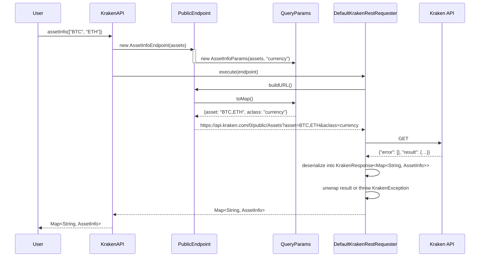
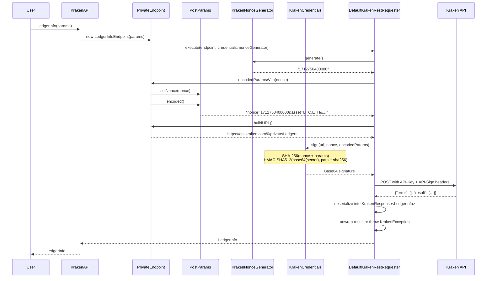
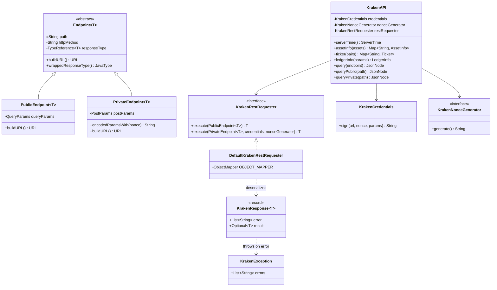

# Library Architecture

## Overview

The library is a Java client for the [Kraken REST API](https://docs.kraken.com/rest/). It is organized around four core concepts:

- **`KrakenAPI`** — The main entry point. A facade that exposes typed methods for implemented endpoints and generic methods for any endpoint.
- **`Endpoint<T>`** — Represents a single API call. Knows its HTTP method, URL path, parameters, and response type. Splits into `PublicEndpoint<T>` (GET) and `PrivateEndpoint<T>` (POST with HMAC signing).
- **`KrakenRestRequester`** — Interface that performs the actual HTTP request and response parsing. `DefaultKrakenRestRequester` is the built-in implementation using `HttpsURLConnection`.
- **Params / Response types** — Each endpoint has dedicated parameter objects (`QueryParams` for public, `PostParams` for private) and response records deserialized via Jackson.

## Request Flow

### Public Endpoint

### Private Endpoint

## Component Diagram

## Three Access Tiers

`KrakenAPI` provides three levels of access, from most to least typed:

| Tier | Methods | Return type | When to use |
|------|---------|-------------|-------------|
| **Typed** | `assetInfo()`, `ledgerInfo()`, etc. | Domain records | Endpoint has a dedicated implementation |
| **Enum-based** | `query(Public.TICKER, params)` | `JsonNode` | Endpoint is in the `Public`/`Private` enum but not yet typed |
| **Raw path** | `queryPublic("Trades", params)` | `JsonNode` | Endpoint isn't in the enum yet (e.g., newly added by Kraken) |

## Extending the Library

To add a new typed endpoint:

1. Create a response record in the appropriate `response/` package
2. Create a params class implementing `QueryParams` (public) or extending `PostParams` (private)
3. Create an endpoint class extending `PublicEndpoint<T>` or `PrivateEndpoint<T>`
4. Add a convenience method to `KrakenAPI`
